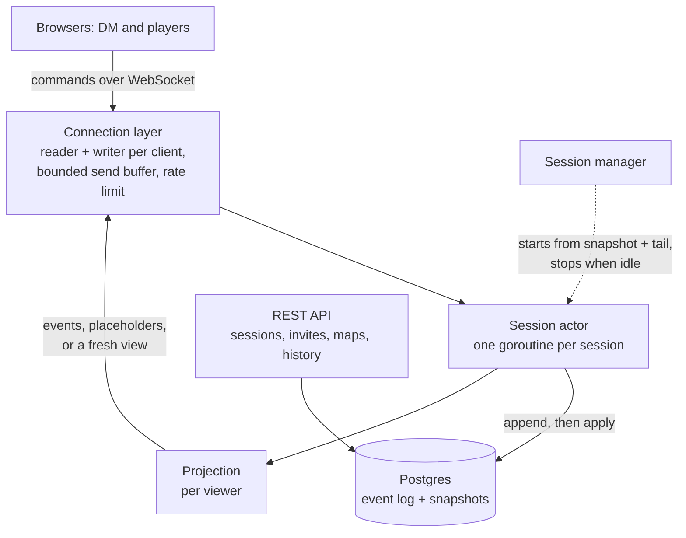

# Yorm

A live battle map for tabletop RPGs. The DM builds a map from an image or paints walls and difficult terrain onto a blank grid; players join from an invite link and move their own tokens, and everyone sees every move instantly. It runs combat for the table: initiative, turns, movement, actions, HP, conditions, and a shared dice log that takes server rolls or real dice. Tokens can carry uploaded pictures, and the DM can draw freehand on the map with a pen. Fog of war, hidden tokens, and secret rolls are enforced by the server, so a player's browser never receives what they aren't meant to see.

The Go server is authoritative: every rule lives there, every change is an event in an append-only log in Postgres, and a crashed server comes back exactly where the table left off.

## Architecture



- **One actor per session.** Each session's state is owned by a single goroutine; commands arrive on its inbox and are handled one at a time, so the game state needs no locks and every client sees events in the same order.
- **Persist, then apply.** `game.Decide` validates a command against the state and returns events; the actor appends them to Postgres, and only then applies and broadcasts them. If the append fails, nothing is broadcast. `Apply` is deterministic (no clocks, randomness, or I/O; dice are rolled in `Decide` and stored in the event), so replaying the log rebuilds the state exactly.
- **Snapshots and catch-up.** The actor snapshots every 200 events or 5 minutes; a session starts from its latest snapshot plus the events after it. A reconnecting client sends the last event it applied and gets just what it missed, or a snapshot if it's far behind.
- **Safe retries.** The actor remembers the answer to the last 1,000 commands; a command resent after a reconnect (the browser resends anything unanswered) is answered again, never applied twice.
- **Visibility.** The DM gets every event as is. For each player, `game.Project` returns the event with hidden details removed, or a bare placeholder that keeps sequence numbers continuous. When an event changes what a player can see (a token revealed, fog lifted), they get a fresh `State.View` instead. Snapshots and catch-up go through the same projection.
- **Group commit.** Appends from all sessions are committed by a few writer goroutines, which batch whatever is queued into one transaction. Under light load a batch is one append; under heavy load one disk flush covers many commands.
- **Two actors for one session can't both write.** Appends move the session's `last_seq` forward only from the value the actor expects; a stale actor's append affects no rows, and it shuts itself down.

## Running it

Needs Go 1.26+, Node 24+, and Docker.

```sh
make db-up                 # Postgres in Docker
make run                   # the server on :8080
make web-install web-dev   # the frontend on :5173, proxying to :8080
```

Or everything in containers: `docker compose up --build`, then open http://localhost:8080. Add the metrics dashboard with `make monitoring` (Grafana on :3000, Prometheus on :9090).

Configuration is by environment variable; see [internal/config](internal/config/config.go).

## Testing

| Layer | What it checks | Run it |
|---|---|---|
| Unit | Rules: movement cost, initiative, turns, HP, dice parsing, visibility | `make race` |
| Property | Thousands of random commands from random users: the state stays sound (HP in range, the active turn is a combatant, …); replaying from nothing or any snapshot equals the live state; and for every player, the state rebuilt from only what they were sent equals their view and holds nothing hidden | `make race` |
| Fuzz | Arbitrary bytes as any command, any stored event, any dice roll, any join token: no panics, and accepted commands keep the state sound | `make fuzz` |
| Integration | Real Postgres (testcontainers) and real WebSockets: a scripted combat, reconnecting mid-fight, visibility over the wire, restarts | `make integration` |
| Chaos | `kill -9` of the real server binary mid-game, then a restart: bots reconnect, every acknowledged command is in the log, none applied twice, every bot's state matches its view | `make chaos` |
| Load | N tables of 6 bots playing combat; latency from sending a command to its event reaching each client, lost or out-of-order events, and each client's state hash against the server's view | `make load SESSIONS=500` |
| Browser | Playwright against the built app (run by hand during development) | |

CI runs lint, unit, race, and integration tests on every push, and a [nightly job](.github/workflows/nightly.yml) runs the chaos test and the full load test.

## Results

**Recovery:** a session with 5,000 events restores in **~5 ms** from its snapshot plus the 199 events after it (a full replay of all 5,000 takes ~15 ms), against the spec's target of 200 ms. (`TestRecoveryTime`)

**Chaos:** three games of six bots, the server killed with SIGKILL after ~1,000 commands and restarted: all ~2,400 acknowledged commands were in the log, none applied twice, and all 18 bots ended with exactly the state the server says they should see.

**Load:** 500 sessions × 6 clients = 3,000 WebSockets, each bot acting every ~3 s (≈1,000 commands/s), yormd limited to 2 CPUs and Postgres to 2 CPUs, 2 minutes of play:

| | p50 | p99 | Lost / out of order | Diverged |
|---|---|---|---|---|
| Target | ≤ 10 ms | ≤ 50 ms | 0 | 0 |
| **GitHub-hosted Linux VM, durable Postgres** (nightly job) | **1.9 ms** | **38 ms** | 0 | 0 |
| Dev machine, Postgres on a RAM disk (isolates the server) | 0.9 ms | 3.5–5 ms | 0 | 0 |
| Dev machine, durable Postgres, best runs | 4.6–5.3 ms | 10–27 ms | 0 | 0 |

Every run, however slow, lost nothing and ended with zero divergence across 3,000 clients (850,000 events per run). yormd itself used about **0.6 of its 2 cores** and ~700 MB.

**What latency depends on.** On a durable disk, each command costs a flush of Postgres's write-ahead log. The development machine (Docker Desktop on WSL2) manages about 440 flushes a second, and its flush times are erratic: identical runs ranged from a p99 of 10 ms to several seconds, while the same load with Postgres on a RAM disk was consistently under 5 ms. On a GitHub-hosted Linux VM the same test passes on durable storage (above); the nightly job keeps measuring it there.

**How it got there.** The first full-size run had a p99 of 11.8 s. Server metrics (`yorm_event_append_seconds`) showed commits queueing behind the disk, not CPU:

1. Appending took four round trips (`BEGIN`, update the session, insert the events, `COMMIT`). Making it **one statement** (a data-modifying CTE that moves `last_seq` and inserts only if it matched) brought p99 to 10 ms at 1,000 commands/s.
2. A **bigger connection pool** made things worse (p99 27 ms with 32 connections vs 10 ms with 12): on a small Postgres, more concurrent commits mostly fight over the WAL lock. The default stays at pgx's.
3. **Group commit** in the server batches appends across sessions, so throughput under a slow disk degrades by growing batches (they averaged 3 appends in a slow run) rather than by queueing one commit per command.

Load generator: `cmd/yormload`; results as JSON with `-json`.

## Layout

| Path | What |
|---|---|
| `cmd/yormd` | The server |
| `cmd/yormload` | The load generator |
| `internal/game` | Rules and state: `Decide`, `Apply`, movement, combat, visibility. No I/O. |
| `internal/dice` | Dice expression parser and roller |
| `internal/session` | Session actors and the manager: persistence, snapshots, catch-up, projection per client |
| `internal/store` | Postgres: event log, snapshots, group commit |
| `internal/ws` | WebSocket connections: auth, read/write loops, rate limit |
| `internal/httpapi` | REST API and routing |
| `internal/bot` | Scripted clients for the load and chaos tests |
| `internal/metrics` | Prometheus metrics |
| `web/` | React + Konva frontend |
| `migrations/` | Postgres schema |
| `deploy/` | Prometheus and Grafana config |
